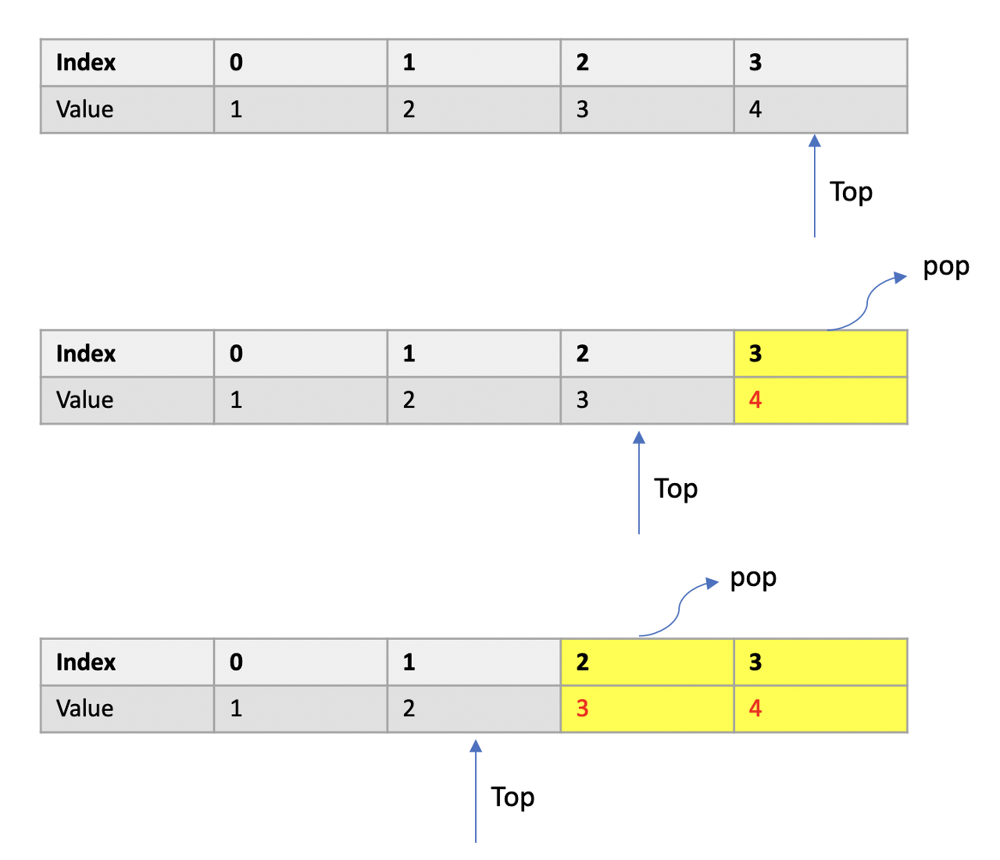

# Item7. 다 쓴 객체 참조를 해제하라

## Stack 메모리 누수

```java
public class Stack1 {

    private Object[] elements;
    private int size = 0;
    private static final int DEFAULT_INITIAL_CAPACITY = 16;

    public Stack1() {
        elements = new Object[DEFAULT_INITIAL_CAPACITY];
    }

    public void push(Object e) {
        elements[size++] = e;
    }

    public Object pop() {
        if (size == 0) {
            throw new EmptyStackException();
        }
        return elements[--size];
    }

    public Object get(int i) {
        return elements[i];
    }

    /**
     * pop을 했지만 실제로 메모리에서 제거되지 않아서 메모리 누수가 발생한다.
     */
    public static void main(String[] args) {
        Stack1 stack1 = new Stack1();
        stack1.push("1");
        stack1.push("2");
        stack1.push("3");

        for (int i = 0; i < 3; i++) {
            System.out.println(stack1.pop());
        }

        for (int i = 0; i < 3; i++) {
            System.out.println(stack1.get(i).toString());
        }
    }
}
```

기능적으론 문제 없지만 메모리 누수가 발생한다. pop을 했지만 실제로 메모리에서 제거되지 않아서 메모리 누수가 발생한다.



<br>

## Stack 메모리 누수 해결 방법

```java
public Object pop() {
    if (size == 0) {
        throw new EmptyStackException();
    }

    Object result = elements[--size];
    elements[size] = null;

    return result;
}
```

해결 방법은 해당 참조를 다 쓴 후, `null` 처리하면 된다.

```java
public class Stack2 {

    private Object[] elements;
    private int size = 0;
    private static final int DEFAULT_INITIAL_CAPACITY = 16;

    public Stack2() {
        elements = new Object[DEFAULT_INITIAL_CAPACITY];
    }

    public void push(Object e) {
        elements[size++] = e;
    }

    public Object pop() {
        if (size == 0) {
            throw new EmptyStackException();
        }

        Object result = elements[--size];
        elements[size] = null;

        return result;
    }

    public Object get(int i) {
        return elements[i];
    }

    /**
     * 정상적으로 메모리에서 제거된다.
     */
    public static void main(String[] args) {
        Stack2 stack = new Stack2();
        stack.push("1");
        stack.push("2");
        stack.push("3");

        for (int i = 0; i < 3; i++) {
            System.out.println(stack.pop());
        }

        for (int i = 0; i < 3; i++) {
            System.out.println(stack.get(i).toString());
        }
    }
}
```

### 그렇다고 해서 다 쓴 객체를 무조건 null 처리 할 필요는 없다.

특히, 일반적으로 서버는 stateless하게 구성하기 때문에 다 쓴 객체를 무조건 null 처리 할 필요는 없다. 이는 코드를 지저분하게 할 뿐이다.

<br>

## 자바에서 자체 제공하는 Stack은 어떨까?

사실, 위의 `Stack`은 억지로 메모리 누수를 발생시키기 위해 만든 코드이다. 자바에서 제공하는 `Stack`은 메모리 누수가 발생하지 않는다.

```java
public class JavaStack {

    /**
     * 당연히 자바에서 제공하는 Stack은 메모리 누수가 발생하지 않는다.
     */
    public static void main(String[] args) {
        Stack<String> stack = new Stack<>();
        stack.push("1");
        stack.push("2");
        stack.push("3");

        for (int i = 0; i < 3; i++) {
            System.out.println(stack.pop());
        }

        for (int i = 0; i < 3; i++) {
            System.out.println(stack.get(i).toString());
        }
    }
}
```

<br>

## Map 메모리 누수

```java
public class Map1 {
    public static void main(String[] args) {
        Map<Integer, String> map = new HashMap<>();

        Integer key1 = 1000;
        Integer key2 = 2000;

        map.put(key1, "value1");
        map.put(key2, "value2");

        key1 = null;

        System.gc();

        for (Map.Entry<Integer, String> entry : map.entrySet()) {
            System.out.println(entry.getKey() + " : " + entry.getValue());
        }
    }
}
```

위 `Map1`을 실행하면 여전히
```bash
2000 : value2
1000 : value1
```
이와 같은 결과값을 얻는다.

이는 HashMap 내부에서 key를 강한 참조하고 있기 때문에 발생하는 문제이다. 강한 참조는 일반적으로 우리가 생각하는 참조이다.

<br>

## WeakHashMap 약한 참조

```java
public class Map2 {
    public static void main(String[] args) {
        Map<Integer, String> map = new WeakHashMap<>();

        Integer key1 = 1000;
        Integer key2 = 2000;

        map.put(key1, "value1");
        map.put(key2, "value2");

        key1 = null;

        System.gc();

        for (Map.Entry<Integer, String> entry : map.entrySet()) {
            System.out.println(entry.getKey() + " : " + entry.getValue());
        }
    }
}
```

위 `Map2`를 실행하면
```bash
2000 : value2
```
이와 같은 결과값을 얻는다.

`WeakHashMap`은 약한 참조를 사용하기 때문에 GC가 발생하면 메모리에서 제거된다.

<br>

## 그 외 참고

`Integer`, `String` 등은 캐싱이 되는 경우가 있기 때문에 이는 주의할 필요가 있다.
(ex. Integer는 -128 ~ 127까지 강제 캐싱이 된다)

```java
// Integer 내부 구현 중 일부
private static class IntegerCache {
        static final int low = -128;
        static final int high;
        static final Integer[] cache;
        static Integer[] archivedCache;

        static {
            // high value may be configured by property
            int h = 127;
            String integerCacheHighPropValue =
                VM.getSavedProperty("java.lang.Integer.IntegerCache.high");
            if (integerCacheHighPropValue != null) {
                try {
                    h = Math.max(parseInt(integerCacheHighPropValue), 127);
                    // Maximum array size is Integer.MAX_VALUE
                    h = Math.min(h, Integer.MAX_VALUE - (-low) -1);
                } catch( NumberFormatException nfe) {
                    // If the property cannot be parsed into an int, ignore it.
                }
            }
            high = h;
```

그렇기 때문에 key 값으로는 객체의 해시코드를 사용한다거나 하는 식으로 회피해야한다.

## 마치며

다시 말하지만, 스프링에서 일반적으로 위에다가 객체를 저장하고 삭제하는 정적 컬렉션을 사용하는 경우는 거의 없다. 
그렇기 때문에 이러한 상황이 발생하는 것은 극히 드물 것으로 보인다.
일부 변태적인 면접관들이 이러한 질문을 관련된 던질 수도 있다고는 한다.
